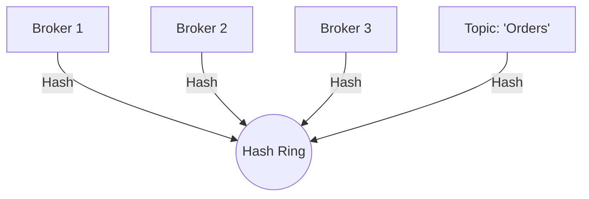

# Load Balancing Implementation Explained

This document explains the decentralized load balancing logic implemented in LogStream using **Consistent Hashing**.

## Core Concept: The Ring

In a traditional system, a central "Load Balancer" server directs traffic. In our decentralized system, every Broker makes its own decision using a mathematical model called a **Consistent Hash Ring**.

Imagine a circle (Ring) where every point is a number from `0` to `4,294,967,295` (32-bit integer range).



### 1. Placing Nodes
When a Broker starts, we calculate a hash of its ID (e.g., `CRC32("Broker1")`). This maps the broker to a specific point on the ring.
*   **Broker A** -> Hash: 1000
*   **Broker B** -> Hash: 5000

### 2. Placing Data
When data arrives, we hash its **Topic** (e.g., `CRC32("TopicA")`). This also maps to a point on the ring.
*   **Topic A** -> Hash: 3400

### 3. Finding the Owner
To find who owns the data, we look at the data's position on the ring and move **clockwise** until we hit a Broker.
*   Start at **3400** (Topic A).
*   Next broker is at **5000** (Broker B).
*   Therefore, **Broker B owns Topic A**.

## Implementation in LogStream

Since LogStream uses **UDP Multicast**, we cannot physically route the packet to just one node. Every node receives every message. We simply filter them out at the application layer.

### The Flow
1.  **Discovery**: Brokers broadcast `HEARTBEAT` messages. Every broker builds an identical local map of the Hash Ring based on these heartbeats.
2.  **Reception**: A [DataMsg](file:///c:/Users/pedro/Desktop/Tercero/Distributed%20Systems/LogStream/internal/protocol/messages.go#23-26) is multicast to the group.
3.  **Filtering**:
    *   **Broker A** receives the msg. It calculates: *"Who owns this topic?"*. The Ring says *"Broker B"*. Broker A **drops the message**.
    *   **Broker B** receives the msg. It calculates: *"Who owns this topic?"*. The Ring says *"Broker B"* (Me!). Broker B **persists the message**.

### Code Logic ([main.go](file:///c:/Users/pedro/Desktop/Tercero/Distributed%20Systems/LogStream/main.go))

```go
// owner is calculated using the local ring
owner := b.ring.GetNode(msg.Topic)

if owner == b.id {
    // I am the owner. Process and save.
    processData(msg)
} else {
    // I am not the owner. Ignore.
    ignore(msg)
}
```

## Benefits
1.  **Decentralized**: No single point of failure. If the Leader dies, load balancing still works because every node has its own Ring.
2.  **Scalable**: If you add a new Broker, it inserts itself into the Ring. It automatically takes ownership of some topics from its neighbor, sharing the load.
3.  **Stateless Routing**: No need to maintain a central table of "Topic -> Broker". The math (Hashing) determines it dynamically.
